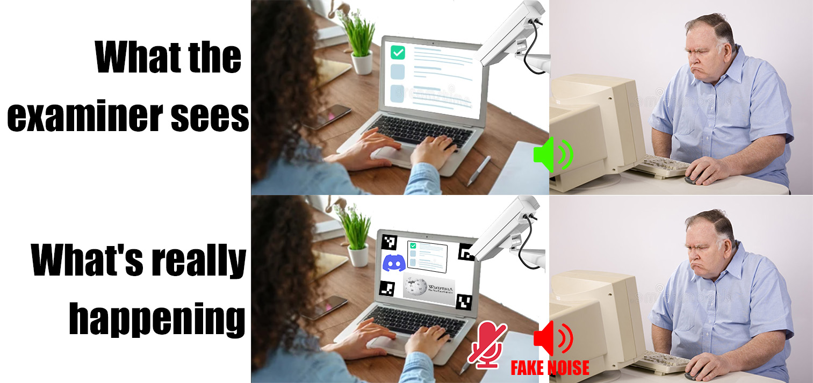
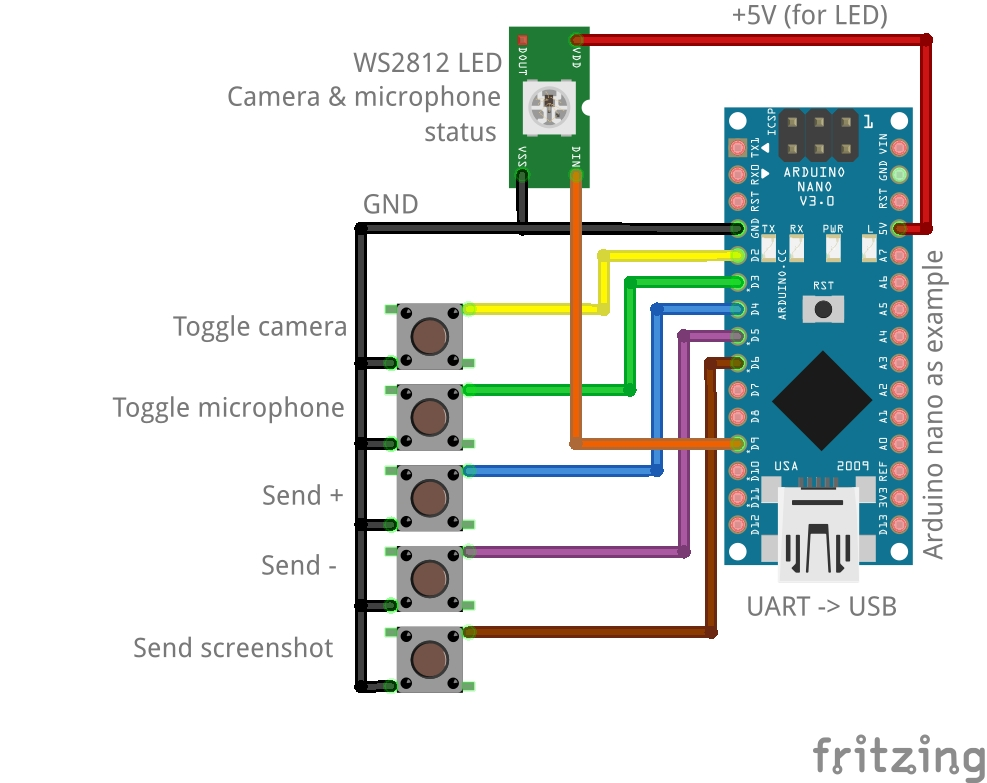

<h1 align="center">Podmiha exam helper</h1>

    

        
    

    

        
        
        
        
        
        
    

----------

## What is it?

This application will help you pass the online exam.
- *Forced to show the computer screen to the camera?* No problem, Podmiha replace the screen image with the desired window (for example, a virtual machine).
- *Forced to keep the microphone on?* No problem, Podmiha will allow you to pause the microphone and add fake noise.
- *Forced to show hands?* No problem, Podmiha implements the ability to control the camera and microphone **with your feet**, as well as send messages and screenshots to the Telegram chat. (You can call a friend to dictate the answer to you)

## Disclaimer

- You use the application at your own risk.
- The author of the application is not responsible for unauthorized use.
- The author of the application is not responsible for any consequences that may result from the use of this application.
- By using the application, you automatically agree to the above

## Installation and use

### Installation

1. Download latest release from *Releases* and unpack it. *Note: currently available only for Windows*
2. To use virtual camera output download and install Open Broadcast Software (OBS) `https://obsproject.com/`
3. To use microphone pause and fake noise download and install any virtual audio cable driver. For example VB-CABLE: `https://vb-audio.com/Cable/index.htm`
4. To use virtual OS as screen replacement download any virtual machine (For example: `https://www.virtualbox.org/wiki/Downloads`) and install OS on it
5. To use telegram messages create Bot `https://t.me/botfather`, invite it to your chat and get chat ID by inviting `https://t.me/RawDataBot` to your chat

### How to use

#### Screen faking

1. Select window in `Window capture` section
2. Select fake type in `Window capture` section
3. Select `Fake screen` Check box
4. You can view your window in preview filed by selecting `Window`
5. Select and open camera in `Camera` section
6. By default, the camera **will be paused**! To turn on, press the camera button on the control panel or the button on the foot controller.

#### Microphone pause and fake noise

1. Select microphone and virtual cable input devices in `Audio` section
2. Select sample rate
3. Press `Open audio devices` button
4. By default, the microphone **will be paused**! To turn on, press the microphone button on the control panel or the button on the foot controller.
5. Adjust noise level. **Noise will be present even when paused**!

#### Telegram messages

1. Paste token into `Bot token` field in `Telegram bot` section
2. Paste chat ID `Chat ID` field in `Telegram bot` section
3. Select `Bot enabled` Check box
4. In addition, you can specify the text of the messages below
5. To send messages, press plus/minus/send screenshot buttons on control panel or buttons on foot controller

#### Foot control

1. Connect controller via serial port
2. Select serial port in `Control via serial port` section
3. Select `Connected` Check box

## Foot (serial) controller

You can control the camera, microphone, and send messages and screenshot hands-free.
To do this, you need to assemble a simple circuit shown below.
You can use any Arduino or BluePill board as a controller, etc.

    

        
    

In addition to controlling, the current system status is also displayed in the following colors:
- Camera active, microphone active: **Orange** (RGB: 40, 20, 0)
- Camera active, microphone paused: **Red** (RGB: 40, 0, 0)
- Camera paused, microphone active: **Yellow** (RGB: 20, 40, 0)
- Camera paused, microphone paused: **Green** (RGB: 0, 40, 0)

For example, you can fix the LED on the table, and the buttons on the floor and thus control the system

## ARUco detector parameters

In order to improve aruco detection Podmiha has `detector parameters` field in the ARUco section

Default values: `7, 30, 1, 0.05, 5, 0.1, 4, 0.35, 0.6, 10, 23`

Order:

1. `7` - `adaptiveThreshConstant`
2. `30` - `cornerRefinementMaxIterations`
3. `1` - `cornerRefinementMethod`
4. `0.05` - `polygonalApproxAccuracyRate`
5. `5` - `cornerRefinementWinSize`
6. `0.1` - `cornerRefinementMinAccuracy`
7. `4` - `perspectiveRemovePixelPerCell`
8. `0.35` - `maxErroneousBitsInBorderRate`
9. `0.6` - `errorCorrectionRate`
10. `10` - `adaptiveThreshWinSizeStep`
11. `23` - `adaptiveThreshWinSizeMax`

See `https://docs.opencv.org/4.x/d5/dae/tutorial_aruco_detection.html` for more info
